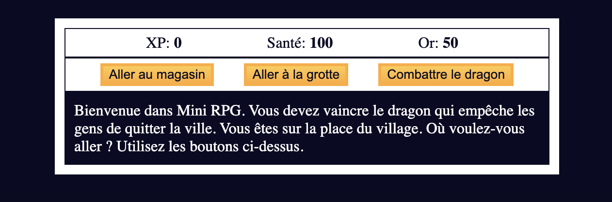
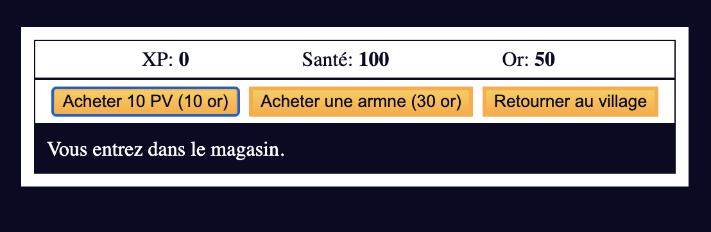
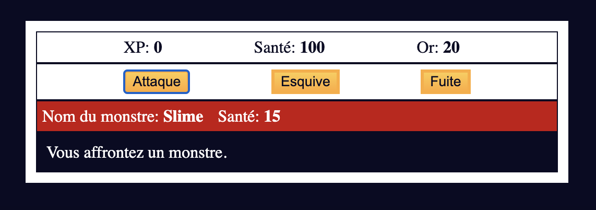

# MINI RPG - Exercice JavaScript, HTML & CSS

N.B: This project is written in French.

## Table of contents

- [Overview](#overview)
  - [The challenge](#the-challenge)
  - [Screenshot](#screenshot)
  - [Link](#link)
- [My process](#my-process)
  - [Built with](#built-with)
  - [What I learned](#what-i-learned)
- [Author](#author)

## Overview

### The challenge

This exercice made me work on:

- Interaction with the DOM
- Const and let management
- Array and Array of Objects management
- Code optimisation
- Basic CSS
- Storage of the player actions and informations (`health`, `xp`, `gold` and `weapon`)

### Screenshots

### Link

- Play the game: [MINI RPG](https://nejih.github.io/mini-rpg/)

## My process

### Built with

- HTML5
- CSS
  - Flexbox
- Mobile-friendly workflow
- JS Vanilla

### What I learned

With this project, I learned how to organise and manage all the content of the game in my JavaScrit file.

## Author

- GitHub - [NejiH](https://github.com/NejiH/)
